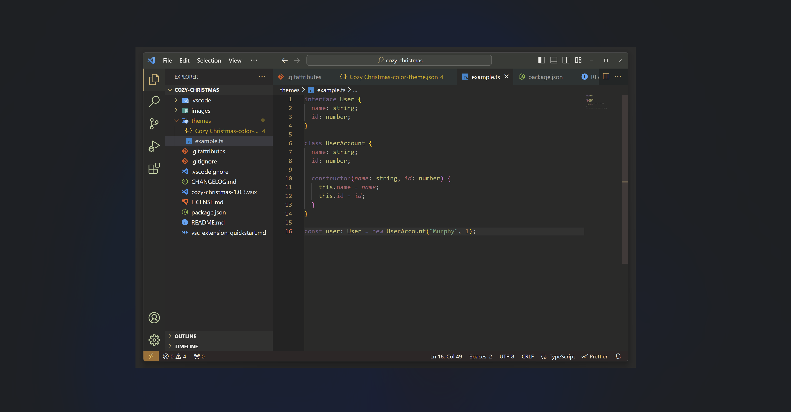
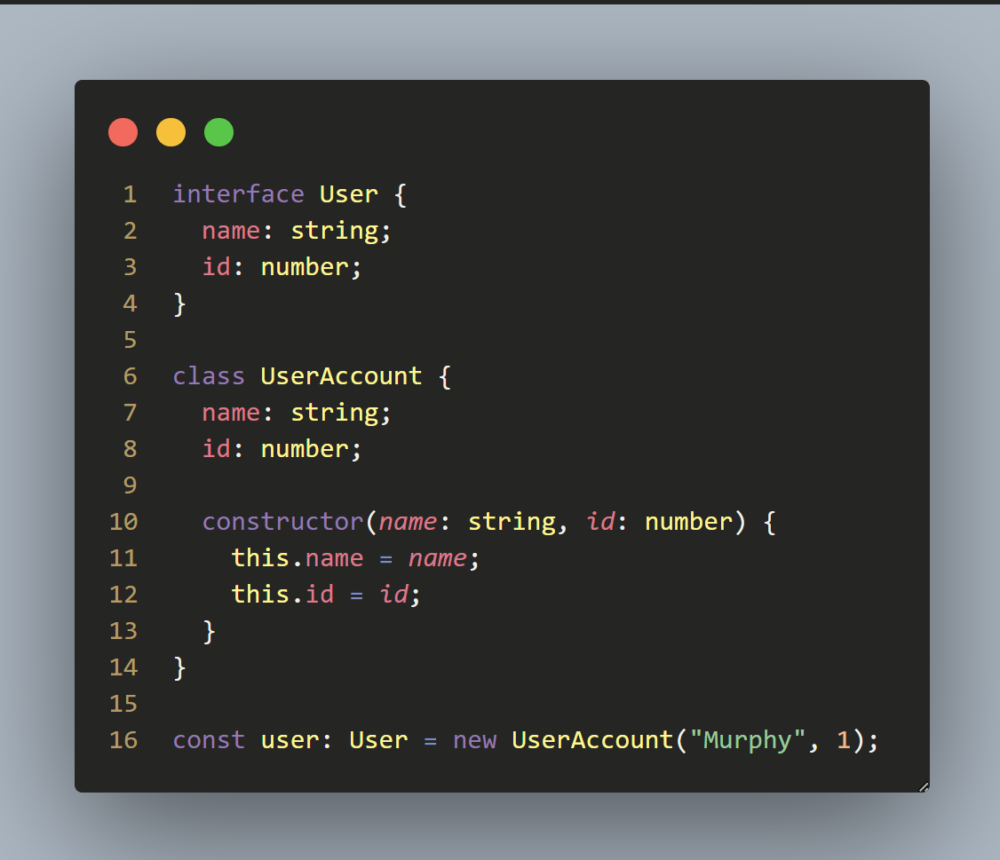
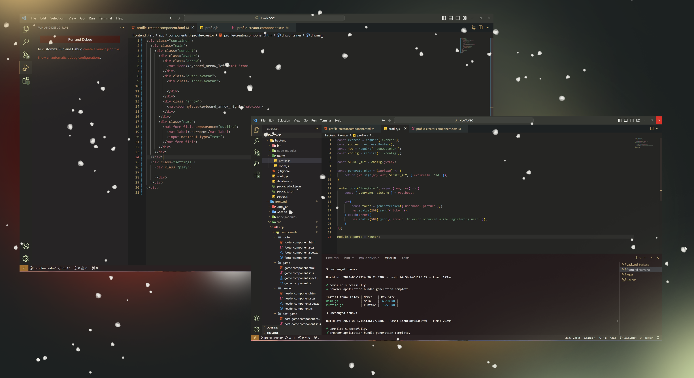

# 🎄 Cozy Christmas 🎄

## A Visual Studio Code theme 🌠

 
 

### 🍪 Cozy pastel font colors 

### ⛄ Christmas themed panels and colors 🧑‍🎄

## Installation

1. Open Visual Studio Code Code Extention sidebar
2. Search for Cozy Christmas
3. Click Install
4. Click "Set Theme"
5. Enjoy your Christmas